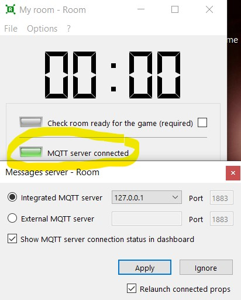
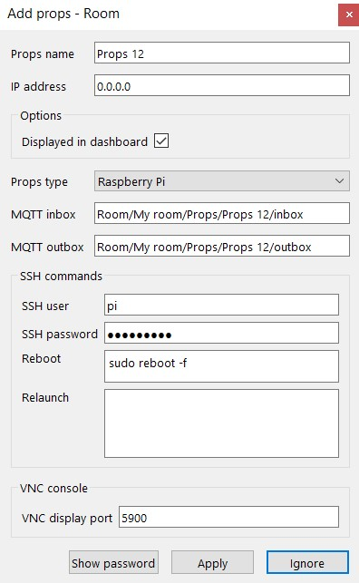

# Setup document
[Github](#github-workflow)  
[XCape.io](#xcapeio-workflow)  
[Debuggen](#debuggen)  
[Camera's](#cameras)

# Github workflow
Voordat we verder gaan met het opzetten van je lokale werkomgeving, gaan we het eerst hebben over de structuur.

Onze escape room bestaat uit verschillende challenges, elk met geen, één, of meerdere props. Om het overzicht te behouden werken we met de volgende folder structuur:
```bash
github-repo
├───IPAdress.txt (overzicht met alle IP Adressen per prop)
├───Challenge1
|   └───...
├───Challenge2
|   └───...
├───Challenge3
|   └───...
├───Challenge4
|   └───...
└───Challenge5
    └───Prop Kluis
        ├─── Prop.py (prop logica)
        └─── LCD.py (lcd scherm)
```

De bedoeling is dat iedereen lokaal werkt aan zijn prop binnen een challenge.    
  
  
Indien meerdere mensen werken aan eenzelfde prop, probeer dan met branches te werken. Je kan werken met applicaties zoals [Bitbucket](https://www.atlassian.com/software/bitbucket/bundle) of [Github Desktop](https://desktop.github.com/) om makkelijk te werken met branches of je werkt met commando's. (zie hieronder)

Om een branch aan te maken, volg deze stappen.
```bash
git checkout main
git fetch origin
git reset --hard origin/main
```
Deze stappen zorgen ervoor dat je local copy mee is met de laatste versie van je codebase.

```bash
git checkout -b *prop-feature*
```

Check of dat je in de juiste branch zit met 
```bash
git status
```

# XCape.io workflow
Installeer [XCape](https://xcape.io/) (disable je adblocker mochten er problemen zijn).

XCape is een MQTT GUI met verschillende functionaliteiten. Hierin zit dus een integrated MQTT server waarop apparaten (arduino's, RPI's, ...) kunnen verbinden en met elkaar kunnen communiceren door te subscriben op topics. 

Voordat we iets gaan doen, checken we of dat onze MQTT server runt. Deze runt dus lokaal bij jezelf op je computer, op poort 1883.  




De interface van XCape is nu niet bepaald de meest user friendly one, dit kan dus ook snel vrij complex & verwarrend worden. Het is dus vrij vervelend om álles hier neer te zetten, kijk daarvoor zeker eens de [documentatie](https://xcape.io/public/documentation/en/room/Contents.html).

Om toch de belangrijkste zaken eruit te halen: 
- Je moet ingelogd zijn als admin om props toe te voegen / je XCape interface aan te passen. Je aanmelden als admin kan heel simpel via **Options > Admin Mode** met het wachtwoord **1234**
- Om de configuratie in te stellen bij MQTT Clients (Arduino, RPI, ...) heb je wat configuratie info nodig, zoals het topic, naam van je MQTT broker, enzovoort. Deze informatie vindt je terug in **Options > Configure the room > Game setup**. 

## Toevoegen nieuwe Prop

Om een nieuwe prop toe te voegen & te verbinden met je MQTT broker, ga je naar **Options > Configure the room > Connected props**. 

Duw beneden op het **+** icoontje om een nieuwe prop toe te voegen. Hier krijg je een overzicht van enkele zaken die ingevuld moeten worden om een nieuwe prop toe te voegen (zoals inbox, outbox om de in- en uitgaande communicatiekanalen vast te leggen) alsook het **statisch IP adres**. Elke prop heeft een eigen statisch IP, deze vindt je terug in IPAdress.txt.



Bekijk het voorbeeld van de LED Blink Arduino file om te zien wat je moet instellen op je Arduino om te kunnen verbinden. Voor Raspberry PI volgt er nog een voorbeeld.


# Debuggen

Voor het testen en debuggen van je applicatie maak je gebruik van de terminals. In **XCape** heb je een application log waarbij alle communicatie tussen je props kan getracked worden. Je kan dit bekijken via File > Application log.

Voor je **Arduino** maak je gebruik van de Serial Monitor. In de Arduino IDE kan je via Tools (nl: Hulpmiddelen) de Serial Monitor openen. Hierin kan je debuggen, dit met de klasse [Serial](https://www.arduino.cc/reference/en/language/functions/communication/serial/). De belangrijkste functie die we gaan gebruiken om te debuggen is print of println():
```C++
Serial.println('Prop verbonden!');
```
Voor je **Raspberry Pi** maak je gewoon gebruik van de Python print() functie.


# Camera's

TBA